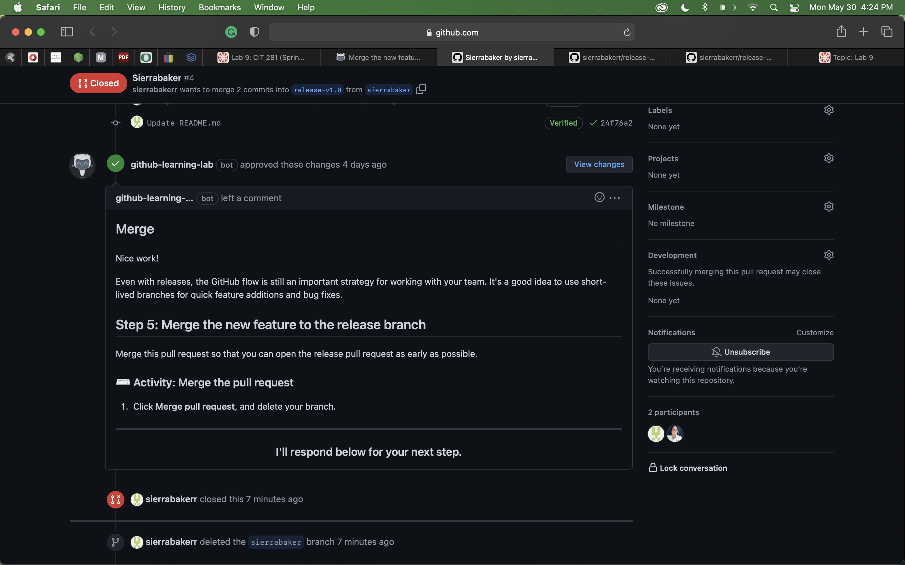

# Lab 9

[RETURN TO HOMEPAGE](https://sierrabakerr.github.io/)

## Lab goals and outcomes:

Part 1: Create Learning Lab course/repo within your GitHub account

Part 2: Practice exiting and returning to the course from course repo

Part 3: Work through course

Part 4: Download completed course repo as deliverable

## Lab Deliverables:

### 1. lab-09.zip (screenshot) -> could not resume due to issues

